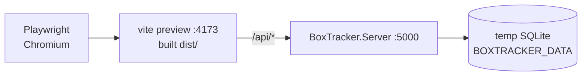

# Plan: Playwright E2E Testing in CI

Goal: verify the real UI works end-to-end on every PR — Fable-compiled client, actual
ASP.NET server, real SQLite — catching regressions that `Domain.Tests` and `Api.Tests`
cannot (broken rendering, routing, Elmish state wiring, API/DTO mismatches).

Related: [ui/pages.md](../ui/pages.md), [domain/api.md](../domain/api.md),
[infra/frontend-pipeline.md](../infra/frontend-pipeline.md), [infra/deployment.md](../infra/deployment.md).

## Architecture under test

Run the **production bundle** (`vite build` output via `vite preview`), not `fable watch`
— faster, deterministic, and closer to what deploys. `preview.proxy` defaults to
`server.proxy`, so the existing `/api → :5000` proxy in `src/Client/vite.config.ts`
works for `vite preview` with no changes.



Each CI run gets a fresh throwaway `BOXTRACKER_DATA` dir, so the DB starts empty and
photo files land in a temp folder.

## Setup

1. Install: `npm i -D @playwright/test` (CI also runs `npx playwright install --with-deps chromium`).
2. Tests live in `tests/E2E/` (mirrors existing `tests/Domain.Tests`, `tests/Api.Tests`).
3. `playwright.config.ts` at repo root, using the `webServer` array to boot both processes:

```ts
import { defineConfig, devices } from "@playwright/test";

export default defineConfig({
    testDir: "tests/E2E",
    workers: 1,                       // single shared SQLite DB — see Isolation
    retries: process.env.CI ? 1 : 0,
    use: { baseURL: "http://localhost:4173", trace: "on-first-retry" },
    projects: [
        { name: "desktop", use: { ...devices["Desktop Chrome"] } },
        { name: "mobile", use: { ...devices["Pixel 7"] } },   // hamburger nav, touch
    ],
    webServer: [
        {
            command: "dotnet run --project src/Server/BoxTracker.Server.fsproj --urls http://localhost:5000",
            url: "http://localhost:5000/api/locations",
            env: { BOXTRACKER_DATA: process.env.E2E_DATA_DIR ?? "./tests/E2E/.data" },
            reuseExistingServer: !process.env.CI,
            timeout: 120_000,
        },
        {
            command: "npx vite preview --port 4173",
            cwd: "src/Client",
            url: "http://localhost:4173",
            reuseExistingServer: !process.env.CI,
        },
    ],
});
```

Locally, run inside the nix shell as always:
`nix develop --command bash -c "npm run build && npx playwright test"`.
In CI no nix is used — same `setup-dotnet`/`setup-node` pattern as the existing jobs.

## CI job (`.github/workflows/ci.yml`)

New job alongside `test`, gating `build`/`deploy` (make `build` `needs: [test, e2e]`):

```yaml
  e2e:
    runs-on: ubuntu-latest
    name: E2E (Playwright)
    steps:
    - uses: actions/checkout@v4.2.0
    - uses: actions/setup-dotnet@v4.2.0
      with: { dotnet-version: '10.0.x' }
    - uses: actions/setup-node@v4.1.0
      with: { node-version: '20' }
    - run: npm ci
    - run: dotnet tool restore
    - run: npm run build            # Fable + Vite production bundle
      timeout-minutes: 10
    - run: npx playwright install --with-deps chromium
    - run: E2E_DATA_DIR=$(mktemp -d) npx playwright test
    - uses: actions/upload-artifact@v4.3.0
      if: failure()
      with:
        name: playwright-report
        path: playwright-report/
        retention-days: 7
```

Cache `~/.cache/ms-playwright` keyed on the `@playwright/test` version to skip the
browser download on warm runs.

## Isolation strategy

- One server + one DB per CI run (cheap, matches the single-user domain). `workers: 1`
  keeps tests deterministic against the shared DB.
- Tests create their **own uniquely named entities** (`Box ${testInfo.testId}`) and never
  assume an empty list — so a failed test's leftovers can't break later tests.
- A test that needs a known-empty world (e.g. "empty state renders") runs first or
  asserts on its own entities only.

## Selector strategy

The client has no `data-testid` attributes today. Prefer user-facing selectors —
`getByRole("button", { name: "Add Box" })`, `getByLabel`, `getByText` — which work with
DaisyUI markup and double as accessibility checks. Where markup is ambiguous (repeated
cards, ⋮ menus), add `data-testid` via `prop.custom("data-testid", ...)` in the Feliz
views rather than writing brittle CSS-class selectors (Tailwind classes change with
styling work).

## Valuable tests, in priority order

Current coverage in `tests/E2E/`: Tier 1 (`smoke.spec.ts`, `nav.spec.ts`), Tier 2
flows 4–10 (`flows.spec.ts`, `search.spec.ts`, `edit.spec.ts`), Tier 3 item 11
(`notes-history.spec.ts`). Beyond the original list, `items.spec.ts` covers
standalone item create/assign/delete, `filters.spec.ts` covers the list text
filters and the Boxes location filter, `edit.spec.ts` covers location code
editing and archiving (archived locations vanish from the list — `GET
/api/locations` excludes them — and from the assign dropdown), and
`notes-history.spec.ts` covers note CRUD. Items 12–19 remain unimplemented.

Flakiness lesson: a bare hash `page.goto` right after the app's own
`Router.navigate` is sometimes missed by the router, leaving the previous
detail page loaded. When a test hash-navigates mid-test and then mutates
state, `page.reload()` after the goto and wait for the target heading. Dialog
POSTs are asynchronous — wait for `.modal-open` to disappear before asserting
their effects elsewhere.

### Tier 1 — smoke (write first; catches "the bundle is broken")

1. **App boots**: `/` renders the navbar and the Boxes landing page; no console errors.
2. **Hash routing**: navbar reaches `#/locations`, `#/items`, search; unknown hash falls
   back to Boxes; deep-link `#/boxes/{id}` straight to a detail page works on reload.
3. **Mobile nav** (mobile project): hamburger dropdown opens and navigates.

### Tier 2 — core domain flows (the reason the app exists)

4. **Create location → create box → assign box to location**; box card shows the
   location; location detail lists the box.
5. **Add new item to a box** (BoxDetail inline form); item appears in the box's list
   and in `#/items`.
6. **Move item between boxes** via the move modal; source box no longer lists it,
   target box does.
7. **Unassign item / remove box from location**; entity shows as unassigned.
8. **Delete box with items** — items must survive as *unassigned* (the key
   event-sourcing invariant; a regression here loses user data associations).
9. **FTS search**: create item in a box at a location → search finds it and shows box
   label + location name (exercises `SyncItemToSearch` denormalization end-to-end).
10. **Edit names**: rename item, box label, location name; change persists after reload.

### Tier 3 — supporting UI behaviours

11. **History modal**: after moving an item twice, timeline shows creation + moves
    oldest-first with readable descriptions.
12. **Photo upload (async job)**: upload a small fixture JPEG on an item; assert the
    thumbnail eventually appears (polling/`applyCompletedPhoto` patch path). Use a
    generous `expect(...).toBeVisible({ timeout })` — the WebP job is async.
13. **Full-screen image viewer**: click a thumbnail → viewer opens; ✕ and
    click-outside close it.
14. **Add existing item modal**: unassigned item appears in the picker; confirming
    moves it into the box.
15. **Mutations patch in place**: after creating a box from the list, no full-page
    spinner/refetch — the card just appears (guards the in-place-update pattern in
    [ui/pages.md](../ui/pages.md)).

### Tier 4 — advanced / optional

16. **QR scanner** with Chromium fake camera: launch with
    `--use-fake-device-for-media-stream --use-file-for-fake-video-capture=fixture.y4m`
    (a y4m rendering of a box QR) and assert scanning navigates to the box. High value
    (untestable any other way) but fiddly — do last.
17. **Label pages render QR codes** (canvas/img present and non-empty) for boxes and
    locations.
18. **Error alert**: block `/api/*` with `page.route(..., abort)` and assert the
    `errorAlert` banner appears instead of a silent hang.
19. **Visual regression**: `toHaveScreenshot()` on the four list/detail pages to guard
    the industrial theme. Only adopt if theme churn slows down — screenshot diffs are
    maintenance-heavy.

## Example spec (Tier 2, flow 4–5)

```ts
import { test, expect } from "@playwright/test";

test("box lifecycle: create, assign to location, add item", async ({ page }, testInfo) => {
    const tag = testInfo.testId;
    await page.goto("/#/locations");
    await page.getByPlaceholder(/name/i).fill(`Garage ${tag}`);
    await page.getByRole("button", { name: /add|create/i }).click();
    await expect(page.getByText(`Garage ${tag}`)).toBeVisible();

    await page.goto("/#/boxes");
    // ...create `Box ${tag}`, open its detail page, pick `Garage ${tag}` in the
    // location dropdown, add item `Lamp ${tag}`, then assert placement text.
});
```

(Exact selectors to be pinned down against the real markup when implementing.)

## Rollout

1. ~~**PR 1**: `@playwright/test` dep, config, CI job, Tier 1 smoke tests.~~ Done.
2. ~~**PR 2**: Tier 2 flows.~~ Done (no `data-testid` needed beyond the nav ones).
3. **PR 3**: remaining Tier 3 (photo upload, image viewer, add-existing modal,
   in-place mutation guard); make the job required for merge.
4. **Later**: Tier 4 as appetite allows.

Budget: Tier 1–3 should run in ~2–3 minutes after the build step; the `npm run build`
(Fable + Vite) dominates job time and mirrors the existing `build` job cost.
